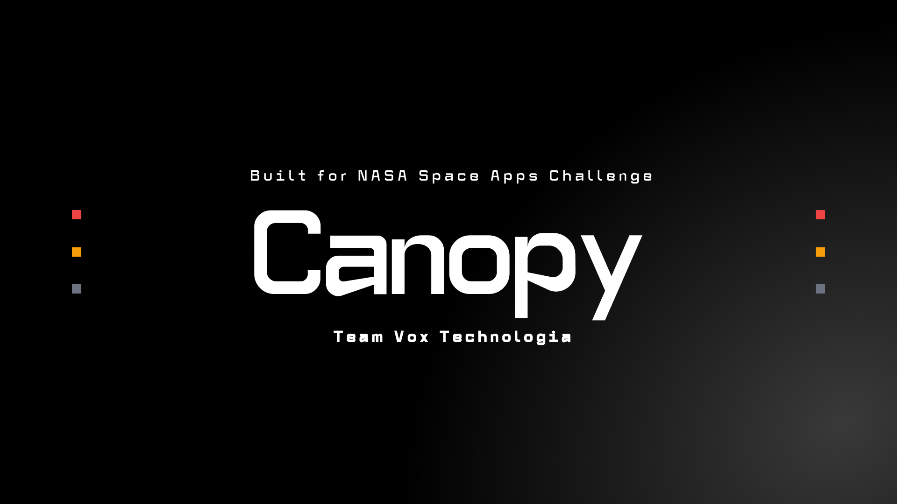
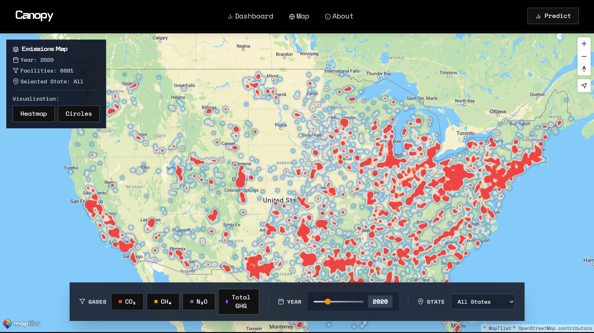
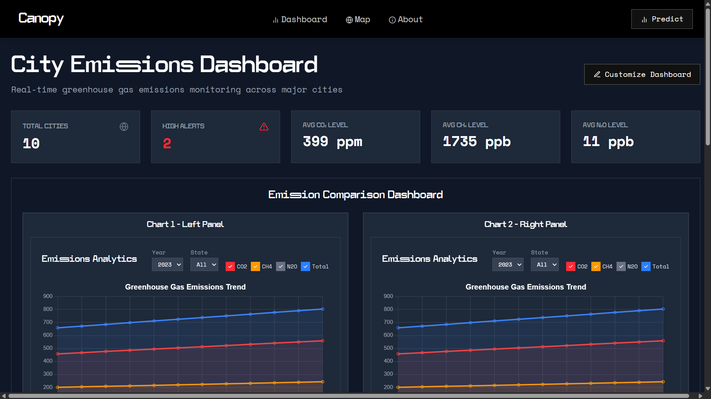
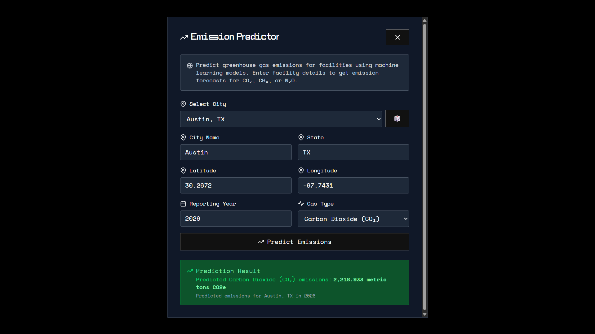

# 🌳 Canopy - Greenhouse Gas Visualization & Prediction Tool

A comprehensive real-time greenhouse gas emissions monitoring and prediction platform that leverages NASA satellite data to provide accurate state-wise GHG emission forecasts across the United States.

## 🌍 Overview

Canopy transforms complex atmospheric data from NASA's satellite constellation into actionable climate insights. Our platform combines real-time data visualization with machine learning-powered predictions to help environmental scientists, policy makers, and researchers understand and forecast greenhouse gas emissions patterns.

### Key Features

- 🛰️ **Real-time NASA Satellite Data Integration**
- 📊 **Interactive Heatmap Visualization**
- 🔮 **ML-powered Emission Predictions**
- 🎯 **State-wise Filtering** for all US states
- 🧪 **Multi-gas Support** (CO₂, CH₄, N₂O)
- 📈 **Historical Trend Analysis**
- 🏃‍♂️ **Real-time Dashboard Updates**
- 🔍 **Advanced Analytics & Comparisons**

## 📸 Screenshots

### Interactive Emissions Map

### Real-time Dashboard

### Prediction Interface

## 🏗️ Tech Stack

### Frontend

- **React 18** - Modern UI library with hooks
- **Vite** - Lightning-fast build tool and dev server
- **Tailwind CSS** - Utility-first styling framework
- **Recharts** - Interactive data visualization
- **Leaflet/MapTiler** - Interactive mapping

### Backend

- **FastAPI** - High-performance Python web framework
- **TensorFlow** - Machine learning model training and inference
- **NASA APIs** - Real-time satellite data integration

## 📊 Data Sources

- **NASA Goddard Earth Observing System (GEOS)**
- **NASA's Orbiting Carbon Observatory (OCO-2/OCO-3)**
- **TROPOMI/Sentinel-5P** - Atmospheric monitoring
- **MODIS Terra/Aqua** - Land surface data
- **EPA Greenhouse Gas Reporting Program** - Validation data

## 🤝 Contributing

We welcome contributions!

1. Fork the repository
2. Create a feature branch (`git checkout -b feature/amazing-feature`)
3. Commit your changes (`git commit -m 'Add amazing feature'`)
4. Push to the branch (`git push origin feature/amazing-feature`)
5. Open a Pull Request

## 👥 Team

Built with ❤️ by Team Canopy at NASA Space Apps Challenge 2025:

- **[Hari Prasad]** - Full-stack Development & ML Engineering
- **[Arden Diago]** -Frontend Development & UI/UX
- **[Kanika Jain]** - Data Analysis & Visualization
- **[Kartik Dewnani]** - Backend Architecture & NASA API Integration
- **[Darshan Heble]** - Machine Learning & Data Processing

## 🙏 Acknowledgments

- **NASA** for providing comprehensive Earth observation data
- **Christ University, Kengeri Campus** for hosting NASA Space Apps Challenge 2025
- **NASA Space Apps Challenge** organizers and mentors
- **Open Source Community** for the amazing tools and libraries

## 🔮 Future Roadmap

- **Global Coverage** - Expand beyond US states to worldwide monitoring
- **Mobile Application** - React Native companion app
- **Real-time Alerts** - Automated notification system for emission spikes
- **Carbon Offset Integration** - Connect with carbon credit marketplaces
- **Industrial Source Identification** - Pinpoint major emission sources
- **Policy Impact Modeling** - Simulate effects of environmental policies

**🌍 Together, let's monitor our planet's health and build a sustainable future! 🌱**

[⭐ Star this repository](https://github.com/itcodehery/NASA-Space-Apps) if you found it helpful!

